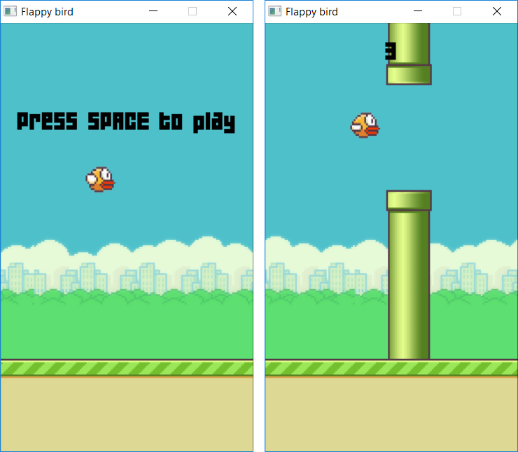
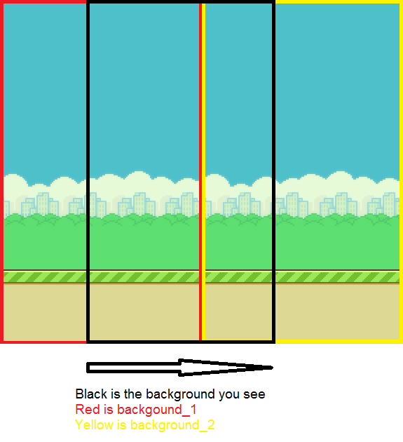

# Flappy bird
This is my first game project cloning [flappy bird](https://en.wikipedia.org/wiki/Flappy_Bird) of Nguyễn Hà Đông

# Table of contents

* [Installation](#installation)
* [How to play](#how-to-play)
* [Built with](#built-with)
* [How to change the bird speed, game fps, etc.](#how-to-change-the-bird-speed-game-fps-etc)
* [How did I make screen endless scrolling?](#how-did-i-make-screen-endless-scrolling)

## Installation
Download or clone this folder to your computer and run file `bin/debug/flappy_bird.exe`

Make sure that the score in file `data/score.txt` is 0
## How to play
Press `space` to play, `y` if you want to try again and `n` if you don't
## Built with
This game is written in C++ and built with:

* [SDL2](https://www.libsdl.org/index.php)
* [SDL_image](https://www.libsdl.org/projects/SDL_image/)
* [SDL_ttf](https://www.libsdl.org/projects/SDL_ttf/)
* [SDL_mixer](https://www.libsdl.org/projects/SDL_mixer/)

## How to change the bird speed, game fps, etc.
You can change them in file `Object.h` and recompline the game with [Code Blocks](http://www.codeblocks.org/)
## How did I make screen endless scrolling?
Look at the following image:

When you read the code you will see some value named background_1, background_2

When the background_1 moves out of the main background, background_1 := background_2 and background_2 is initiated again. That is called fake scrolling. Similar to the ground and block.

When a up-block and a down-block move out of the screen, I add new up-block (UpBlock_2) and down-block (DownBlock_2) and delete the older one. UpBlock_1 (DownBlock_1) always point to the up-block (down-block) in the screen.

&copy; 2017 [giangth2310](https://github.com/giangth2310)
